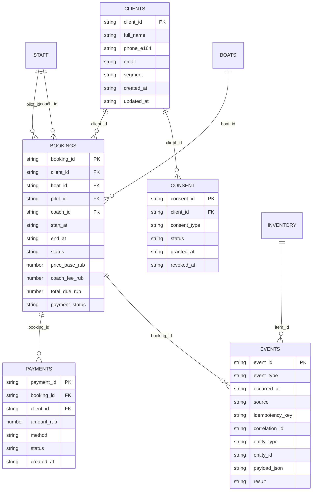

# Промпт и шаблоны Cursor для реализации премиального вейк‑клуба на «Айс пляж» с Google Sheets как единственным SoT

## Executive summary

Ярослав, ниже — исследовательски обоснованный (с опорой на официальные нормы, техдоки и актуальные практики Cursor/Google) **“master‑prompt” для Cursor‑агента** и **полный комплект шаблонов файлов**, которые агент должен генерировать/обновлять в репозитории: `.cursor/skills/*/SKILL.md`, `.cursor/agents/*.md`, `.cursor/rules/*.md`, `docs/*.md`. Ключевая особенность: **Google Sheets — единственный Source of Truth**, а все сервисы (Integration Hub, Dashboard, Voice Agent, уведомления пилоту/тренеру) обязаны синхронизироваться через события и записи в Sheets. При этом агент обязан работать “repo‑first”: сначала читает реальные файлы/структуру репозитория; если репозиторий пуст — создаёт scaffold и прямо помечает это как “создано заново” (а не “обнаружено”). Требование “не придумывать команды/ключи” закреплено как жёсткое правило и поддержано Quality Gates на каждом шаге. citeturn11search10turn4view0

В prompt встроены “hard constraints” по безопасности буксировки и локальным ограничениям:  
- спасжилеты обязательны для лиц на буксируемых средствах (в т.ч. вейкборд) и для других категорий пользователей маломерных судов; citeturn20view0  
- при буксировке кроме судоводителя обязателен наблюдатель за буксируемым средством и находящимися на нём людьми; citeturn20view0  
- запрещено заходить/маневрировать на акваториях пляжей и осуществлять буксировку или приближаться ближе 50 м к границе зоны купания; citeturn18view2  
- в границах пляжей/мест массового отдыха судно обязано двигаться с безопасной скоростью, исключающей волнообразование; citeturn20view0  
- муниципальный запрет эксплуатации маломерных судов и водных мотоциклов в тёмное время суток на акваториях Озернинского и Рузского водохранилищ (кроме исключений). citeturn22view0

По биометрии зафиксирован обязательный режим “опционально”: предоставление биометрических данных не может быть обязательным, и оператор не вправе отказывать в обслуживании при отказе. citeturn2search0  
Также отдельно закреплена ветка “human‑in‑the‑loop”: если идентификация/аутентификация **не автоматизирована** и выполняется с участием уполномоченного лица, то ряд требований закона о биометрической ИС не применяется — это основание для безопасного сценария распознавания “с подтверждением администратором” + альтернативный QR. citeturn24view0

Для Google Sheets детально задана схема листов/колонок, правила валидации и триггеры Apps Script: `onEdit/onChange` (установимые триггеры) и webhook‑flow в Integration Hub. При этом учтено, что **скриптовые исполнения и API‑изменения не запускают простые триггеры** (важно для архитектуры SoT), а время исполнения простых триггеров ограничено (и есть очередность onEdit). citeturn4view0turn4view1  
Для API‑доступа к Sheets учтены квоты, необходимость batch‑операций и экспоненциальный backoff при `429`. citeturn6view0turn0search19turn0search5

Для Cursor‑форматов зафиксированы пути и структура: навыки лежат в `.cursor/skills/<skill>/SKILL.md`, субагенты — в `.cursor/agents/*.md` с YAML frontmatter, правила — в `.cursor/rules/*.md`. citeturn11search0turn11search1turn11search16  
Отдельно учтена практическая оговорка: в актуальных обсуждениях Cursor встречается ограничение “subagents не используют skills напрямую”, поэтому subagent‑файлы содержат явную инструкцию читать нужный `SKILL.md`. citeturn11search19

В части голоса и звонков предложены два поддерживаемых провайдера STT/TTS: **entity["company","Yandex Cloud","cloud platform"]** (SpeechKit) и **entity["company","Сбер","russian bank"]** (SaluteSpeech). Документация подтверждает доступность STT/TTS и интерфейсы API. citeturn3search0turn3search4turn3search9

## Требования и ограничения проекта

### Контур локации и нормативные привязки локации

В документах Рузского округа (перечень мест массового отдыха) одновременно фигурируют:  
- “Озернинское водохранилище…”,  
- и отдельной строкой “вблизи деревни Ново‑Волково (Айс пляж)”,  
- а также “Рузское водохранилище (санаторий ‘Русь’)”. Это создаёт реальный риск, что в коммуникациях и в схеме ограничений акватории команда/подрядчики будут опираться на разные “водохранилища” — поэтому prompt требует фиксировать **два значения**: “как в документах” и “как по факту/гео‑координатам”. citeturn21view0

### Жёсткие технические и продуктовые ограничения

1) **Нельзя придумывать**: команды сборки/линтинга/тестов, CI/CD задачи, секреты, ключи API, имена эндпоинтов, если они не найдены в реальных файлах. Если `Makefile`, `package.json`, `pyproject.toml`, CI‑конфиги отсутствуют — агент обязан написать **«не обнаружено»** и предложить безопасный дефолт (как найти/как создать), явно пометив “создаю новый файл”. citeturn11search10

2) **Google Sheets — единственный SoT**: YCLIENTS/Bitrix не используются; любые “ускоряющие” базы допускаются только как **операционный кэш** (idempotency/ретраи/квоты) и должны быть строго реконструируемы из Sheets. Приоритет чтения/истины всегда у Sheets.

3) **Биометрия опциональна**: клиент должен иметь fallback (QR + администратор). Нельзя блокировать услугу при отказе от биометрии. citeturn2search0turn24view0

4) **Безопасность буксировки** (обязательные требования, которые должны попасть в docs, state‑machine и чек‑листы): жилеты, наблюдатель, расстояние 50 м от зоны купания, запреты на пляжных акваториях, безопасная скорость. citeturn20view0turn18view2

5) **Запрет ночных операций** на акваториях Озернинского и Рузского водохранилищ (муниципальный акт): это обязательно должно учитываться в расписании, правилах переносов и в голосовых сценариях. citeturn22view0

### Входные placeholders заказчика

- Стартовый бюджет: `{{бюджет_на_запуск}}` — **не указано**  
- Количество катеров на старте: `{{количество_катеров}}` — **не указано**  
- Формат клуба: `{{формат_клуба}}` — **не указано**  
- Период работы: `{{период_работы}}` — **не указано**  
- Цель выручки/мес: `{{целевая_выручка}}` — **не указано**  
- Версия Cursor/формат skills/subagents/rules: `{{версия_cursor_и_формат}}` — **не указано**

## Архитектура и контракты интеграции

### Компоненты и ответственность

Архитектура намеренно “event‑driven”, потому что Sheets как SoT плюс квоты API требуют минимизировать “болтливые” синхронизации и обеспечивать идемпотентность.

- **Google Sheets (SoT)** — главные таблицы сущностей + лист `Events` как журнал событий (append‑only).  
- **Integration Hub** — принимает webhooks (включая Apps Script), валидирует/нормализует события, применяет state‑machine, пишет изменения в Sheets батчами.  
- **Dashboard (операционная панель)** — читает данные из Integration Hub (который в свою очередь читает из Sheets) и показывает: расписание, “кто готов”, статусы, KPI, инвентарь.  
- **Voice Agent** — звонки/диалоги, перевод статусов (“выехал/опаздываю/я на месте/готов”), upsell тренера, напоминания. Подключение STT/TTS делается через выбранного провайдера (SpeechKit/SaluteSpeech). citeturn3search0turn3search4turn3search9  
- **Pilot/Trainer notifications** — адаптер уведомлений (например, Telegram/SMS/WhatsApp) с детерминированным форматом карточки слота.

### События, идемпотентность, ретраи и квоты Sheets API

Google Sheets API имеет **пер‑минутные квоты чтения/записи**, а при превышении возвращает `429`, рекомендуя экспоненциальный backoff. Это критично для проектирования Integration Hub: batch‑операции, кэширование, тайм‑слоты синхронизации. citeturn6view0

Для набора изменений по Sheets нужно использовать batch‑операции:  
- `spreadsheets.values.batchUpdate` — запись значений в несколько диапазонов одной операцией; citeturn0search5  
- `spreadsheets.batchUpdate` — изменения структуры/настроек; запросы валидируются и применяются как единый атомарный блок (“или всё, или ничего”). citeturn0search19turn0search2

Это прямо закрепляется в prompt: каждое изменение статуса брони (и связанных сущностей) должно быть “двухфазным”:
1) append события в `Events` (с `event_id`, `idempotency_key`, `correlation_id`),  
2) применение результата в `Bookings/Payments/Clients`,  
3) запись “result/applied_at/errors” в `Events` (или в колонку результата).

### Webhook JSON‑контракты

Минимальный общий контракт события (все источники → Integration Hub):

```json
{
  "event_id": "uuid",
  "event_type": "booking.status_changed",
  "occurred_at": "2026-03-02T12:34:56Z",
  "source": "apps_script|dashboard|voice_agent|system",
  "correlation_id": "uuid",
  "idempotency_key": "string",
  "payload": {
    "booking_id": "uuid",
    "client_id": "uuid",
    "status": "ready|on_water|completed|cancelled|no_show|...",
    "ready_at": "2026-03-02T13:05:00+03:00",
    "coach_assigned": true,
    "boat_id": "uuid"
  },
  "auth": {
    "signature": "hmac_sha256_base64",
    "key_id": "sheets-webhook-1"
  }
}
```

Контракт статуса “готов” (для пилота/тренера) — минимально требуемые поля (как вы запросили):

```json
{
  "booking_id": "uuid",
  "client_id": "uuid",
  "status": "ready",
  "ready_at": "2026-03-02T13:05:00+03:00",
  "coach_assigned": true,
  "boat_id": "uuid"
}
```

### Mermaid‑диаграмма event flow

```mermaid
flowchart LR
  subgraph Sheets[Google Sheets SoT]
    C[Clients]
    B[Bookings]
    P[Payments]
    E[Events (append-only)]
  end

  subgraph AS[Apps Script]
    T1[Installable onEdit/onChange]
    T2[Schema validator]
  end

  subgraph Hub[Integration Hub]
    W[Webhook Receiver]
    V[Validate+Normalize DTO]
    SM[Booking State Machine]
    DEDUP[Idempotency Store (cache)]
    SAPI[Sheets API Adapter: batchGet/batchUpdate]
    N[Notify Pilot/Trainer]
  end

  subgraph UI[Dashboard]
    D[Ops UI]
  end

  subgraph VA[Voice Agent]
    VA1[Dialer+Dialog]
    STT[STT/TTS Provider]
  end

  C -->|read| SAPI
  B -->|read| SAPI
  P -->|read| SAPI
  E -->|append/read| SAPI

  T1 -->|webhook| W
  D -->|REST| W
  VA1 -->|REST| W

  W --> V --> DEDUP --> SM --> SAPI
  SM --> N

  SAPI -->|write batch| Sheets
  D -->|read| Hub
  VA1 --> STT
```

## Google Sheets как единственный SoT

### Почему Apps Script триггеры и какие ограничения нужно учесть

- `onEdit(e)` запускается при редактировании значения пользователем; citeturn4view0  
- **скриптовые исполнения и API‑запросы не вызывают триггеры** (то есть изменения, внесённые Integration Hub через Sheets API, не “поднимут” onEdit) — это означает, что Hub сам должен генерировать события по своим записям, а триггеры нужны прежде всего для “ручных” изменений от операторов/админа; citeturn4view0  
- простые триггеры имеют ограничения: нет‑auth режим для ряда сервисов, исполнение до 30 секунд и ограничение очереди onEdit; citeturn4view0  
- установимые (installable) триггеры умеют вызывать сервисы, требующие авторизации, и выполняются с авторизацией создателя триггера — это критично, если триггер должен отправить webhook наружу. citeturn4view1  
- для исходящих webhook из Apps Script используется `UrlFetchApp`, который предназначен для HTTP(S) запросов и требует соответствующего scope. citeturn3search2  
- для конкурентности (двойные правки, коллизии при массовом редактировании) рекомендуется `LockService`. citeturn3search3  
- хранение конфигов (секрет webhook, key_id, endpoint) внутри Apps Script корректнее делать через `PropertiesService` (script properties). citeturn5search0  
- если нужен inbound endpoint на стороне Apps Script (например, подтверждение оплаты вручную), Apps Script может быть опубликован как web app с `doPost(e)`, возвращая `TextOutput`/`HtmlOutput`. citeturn4view2turn5search1  

### Рекомендуемая структура Sheets и ER‑диаграмма

Ниже — схема листов (как вы запросили) и ключевые FK‑связи. Все ID — UUID v4.



### Таблица схемы Google Sheets (минимально достаточная для MVP)

| Sheet | Назначение | Ключевые колонки (минимум) | Валидация (ядро) |
|---|---|---|---|
| Clients | Единый профиль клиента | `client_id`, `full_name`, `phone_e164`, `email`, `segment`, `created_at`, `updated_at` | UUID, E.164, email, enum segment |
| Bookings | Записи/слоты | `booking_id`, `client_id`, `start_at`, `end_at`, `status`, `boat_id`, `pilot_id`, `coach_id`, `price_base_rub`, `coach_fee_rub`, `total_due_rub`, `payment_status`, `ready_at` | FK, ISO‑datetime, state machine |
| Boats | Катера и статусы | `boat_id`, `name`, `status`, `max_people`, `last_service_at` | enum status |
| Staff | Персонал | `staff_id`, `full_name`, `role`, `phone_e164`, `telegram`, `active` | enum role, E.164 |
| Inventory | Инвентарь | `item_id`, `category`, `size`, `status`, `condition` | enum category/status |
| Payments | Платежи | `payment_id`, `booking_id`, `client_id`, `amount_rub`, `method`, `status` | FK, amount>0, enum |
| Events | Журнал событий | `event_id`, `event_type`, `occurred_at`, `source`, `idempotency_key`, `entity_type`, `entity_id`, `payload_json`, `result` | UUID, uniqueness, JSON validity |
| Consent | История согласий | `consent_id`, `client_id`, `consent_type`, `status`, `granted_at`, `revoked_at`, `doc_link` | enum, FK |

### Валидационные правила и автоматизация (onEdit/onChange + webhook)

Обязательная валидация делится на три слоя:

**Слой схемы (структурный)**  
- Проверка, что листы существуют, заголовки совпадают с canonical‑schema (хранится в `docs/GOOGLE_SHEETS_SOT.md` или `docs/sheets_schema.yml`), обязательные колонки не удалены. Полезно вызывать на `onChange` (структурные изменения). Установимый `onChange`‑триггер запускается при изменении структуры файла (добавление листа/удаление колонок). citeturn4view1

**Слой строк (row validation)**  
- UUID, форматы, enum‑значения, FK‑существование, допустимость перехода статуса.  
- На `onEdit`: определить изменённую строку, прогнать правила, писать ошибки в `validation_errors` и (опционально) подсветку/notes. Предел выполнения простых триггеров и то, что API‑изменения не триггерят onEdit, нужно учитывать. citeturn4view0

**Слой интеграции (webhook)**  
- После успешной валидации installable‑триггер отправляет webhook в Integration Hub через `UrlFetchApp`. citeturn3search2turn4view1  
- Для борьбы с гонками используется `LockService`. citeturn3search3  
- Для хранения секрета подписи webhook применяется `PropertiesService`. citeturn5search0  

## Project Map, Skills и Subagents как контракт результата агента

### Таблица Project Map (шаблон на 7–12 пунктов)

Ниже — именно тот формат, который prompt требует от Cursor‑агента (и который складывается в `docs/PROJECT_MAP.md`). Привязки делаются к реальным путям в репо и к диапазонам Sheets (A1 ranges).

| Узел карты | Где в репо смотреть/создать | Где в Sheets смотреть | Что считается “готово” |
|---|---|---|---|
| Источник правды (SoT) | `docs/GOOGLE_SHEETS_SOT.md` | `Clients!A:Z`, `Bookings!A:Z`, `Events!A:Z` | Схема, правила, диапазоны |
| Контракты DTO | `docs/API_CONTRACTS.md` + `schemas/*.json` | `Events!payload_json` | JSON schemas + примеры |
| State machine брони | `docs/IMPLEMENTATION_BLUEPRINT.md` + `services/integration-hub/...` | `Bookings!status` | Таблица переходов + проверки |
| Apps Script automations | `services/apps-script/` (если есть) | — | installable triggers + webhook |
| Интеграция Sheets API | `services/integration-hub/.../sheets` | — | batchGet/batchUpdate + backoff |
| Уведомления пилоту/тренеру | `services/integration-hub/.../notify` | `Staff!` | delivered status + retries |
| Consent/биометрия | `docs/COMPLIANCE_AND_SAFETY.md` | `Consent!` | fallback QR + отключаемость |
| KPI/аналитика | `docs/IMPLEMENTATION_BLUEPRINT.md` | агрегаты из `Bookings/Payments` | расчёты + дашборд |

### Краткая сводка Skills (12 шт.)

| Skill (папка) | Purpose (1 строка) | Основные триггеры |
|---|---|---|
| sot-sheet-schema | Зафиксировать/проверить схему Sheets как SoT | изменили заголовки/листы |
| sot-sheet-validation | Реализовать валидации строк и статусов | ошибки данных, FK |
| sot-sheets-api-read | Слой чтения Sheets API с квотами/кэшем | медленно/429 |
| sot-sheets-api-write | Атомарная запись (batchUpdate) + идемпотентность | смена статуса/оплата |
| apps-script-triggers | onEdit/onChange + webhook out | ручные правки в Sheets |
| integration-hub-webhooks | Приём webhooks + подписи + дедуп | новые события |
| dto-json-schemas | DTO/JSON schema, валидация payload | любые интеграции |
| booking-state-machine | Таблица переходов статуса + enforcement | некорректные статусы |
| pilot-trainer-notify | Уведомления команде по ready/on_water | клиент готов |
| voice-agent-integration | Контур Voice Agent ↔ Hub ↔ Sheets | звонки/напоминания |
| analytics-kpi | KPI/выручка/LTV/загрузка | отчёты/борд |
| docs-playbook | Генерация/обновление docs и DoD | релиз/изменения |

### Краткая сводка Subagents (6 шт.)

| Subagent | Граница ответственности | Что эскалирует главному агенту |
|---|---|---|
| sheets-sot-architect | схема/валидация Sheets, диапазоны, ER | любые изменения сущностей |
| integration-hub-engineer | webhooks, DTO, idempotency, retries | выбор стека/хостинг |
| apps-script-automation | installable triggers, webhook out, locks | политики доступа |
| compliance-safety-privacy | 152‑ФЗ/572‑ФЗ, consent, water safety | спорные трактовки |
| voice-agent-designer | диалоги/скрипты и интеграция STT/TTS | UX‑тон и сценарии |
| qa-final-gate | DoD, тест‑план, “не обнаружено” дисциплина | релиз‑блокеры |

## Готовый master‑prompt для Cursor‑агента и шаблоны файлов репозитория

Ниже:  
- master‑prompt, который вы вставляете в Cursor Agent;  
- дерево файлов, которые агент должен создать/обновить;  
- содержимое каждого файла (шаблоны).  

Пути и общий формат `.cursor/skills` и `.cursor/agents` соответствуют актуальным практикам Cursor: skills в `.cursor/skills/<name>/SKILL.md`, subagents в `.cursor/agents/*.md`, rules в `.cursor/rules/*.md`. citeturn11search0turn11search1turn11search16

### Master‑prompt для Cursor‑агента

```text
PROMPT:
Ты — ведущий Prompt/Agent-архитектор для IDE Cursor и опытный product+software-архитектор сервисных платформ.
Я — заказчик: Ярослав.

Цель: реализовать проект премиального вейк-клуба на «Айс пляж» как управляемую систему с Google Sheets как ЕДИНСТВЕННЫМ Source of Truth (SoT).
Ты обязан:
1) Прочитать репозиторий (путь/архив/ссылку), выполнить аудит реальных файлов.
2) Проанализировать Google Sheets как SoT: схему листов, диапазоны, валидации, триггеры.
3) Создать/обновить проектную документацию (docs/).
4) Если репозиторий пуст — создать scaffold сервисов (Integration Hub, Dashboard, Voice Agent) и сразу пометить, что файлы созданы “с нуля”.
5) Сгенерировать 8–14 Skills и 4–7 Subagents в формате Cursor.
6) Сгенерировать .cursor/rules/*.md, которые закрепляют обязательные ограничения.

Входные данные:

A) Репозиторий
- Корень проекта (путь/архив/ссылка на репозиторий): {{путь_к_проекту_или_архив}}
- Версия Cursor и ожидаемый формат Skills/Subagents/Rules: {{версия_cursor_и_формат}}

B) Продуктовые параметры
- Локация: «Айс пляж» (в документах встречается привязка к Озернинскому/Рузскому водохранилищам)
- Целевая аудитория: жители ближайших поселков, Москва/МО/Истринский район
- Базовая цена: 12 000–14 000 ₽
- Тренер: 3 500 ₽
- Стартовый бюджет: {{бюджет_на_запуск}}
- Катеров на старте: {{количество_катеров}}
- Формат клуба: {{формат_клуба}}
- Период работы: {{период_работы}}
- Цель выручки/мес: {{целевая_выручка}}

C) Google Sheets SoT
- Spreadsheet ID: {{google_sheets_spreadsheet_id}}
- Способ доступа: {{oauth|service_account|не_указано}}
- Sheets URL (опционально): {{google_sheets_url}}
- Статус доступа: {{есть_доступ|нет_доступа}}

Hard constraints (обязательные ограничения):
1) Нельзя придумывать команды/ключи/секреты/эндпоинты.
   - Если Makefile/package.json/pyproject/CI не найдены: написать явным текстом «не обнаружено».
   - Предложить безопасный дефолт: где искать/как создать.
2) Google Sheets — единственный SoT. YCLIENTS/Bitrix НЕ используются.
3) Триггеры Sheets:
   - учесть, что скриптовые исполнения и API-запросы не вызывают onEdit; события по API-записям должен генерировать Integration Hub.
4) Биометрия опционально:
   - обязателен fallback: QR + human-in-the-loop подтверждение.
   - нельзя отказывать в обслуживании при отказе от биометрии.
5) Безопасность буксировки и локальные ограничения должны быть отражены в docs и в state machine:
   - жилеты обязательны для буксируемых средств (в т.ч. вейкборд),
   - при буксировке обязателен наблюдатель, кроме судоводителя,
   - запрет маневров на акваториях пляжей,
   - запрет буксировки/приближения ближе 50 м к зоне купания,
   - безопасная скорость у пляжей (без волнообразования),
   - запрет ночных операций по муниципальному акту (если применимо в локации).
6) Если доступ к репо/Sheets отсутствует:
   - работать с mock-данными и шаблонной структурой;
   - везде помечать «не указано»/«mock», чтобы заказчик не принял это за факт.

Обязательные действия (порядок):
1) Repo audit (только по реальным файлам):
   - стек, точки входа, конфиги, окружения, тесты, CI/CD.
   - если пусто: создать scaffold и пометить как “создано заново”.
2) Google Sheets SoT audit:
   - проверить наличие листов: Clients, Bookings, Boats, Staff, Inventory, Payments, Events, Consent.
   - проверить заголовки и диапазоны, предложить схему колонок (если не задана).
   - описать валидационные правила и триггеры (installable onEdit/onChange).
3) Implementation Blueprint:
   - event-driven архитектура, DTO, контракты webhooks, идемпотентность, retry/backoff, security, secrets handling, retention policy (placeholders).
4) Создать docs/:
   - PROJECT_MAP.md (7–12 пунктов),
   - IMPLEMENTATION_BLUEPRINT.md,
   - GOOGLE_SHEETS_SOT.md (сheets schema + validations + triggers + ranges),
   - API_CONTRACTS.md,
   - BACKLOG_90_DAYS.md,
   - COMPLIANCE_AND_SAFETY.md.
5) Создать/обновить Cursor артефакты:
   - .cursor/rules/*.md
   - .cursor/skills/*/SKILL.md (8–14 skills, не меньше 8)
   - .cursor/agents/*.md (4–7 subagents)
   В каждом SKILL/Subagent обязаны быть поля:
   Purpose, Scope, Triggers, Context to Read (файлы/Sheets), Steps, Output Format, Quality Gates (DoD), Non-goals, Repo-specific pitfalls.
6) Выход формата (строго):
   A) Executive summary (коротко)
   B) Project Map (7–12 пунктов)
   C) Implementation Blueprint (события, контракты, интеграции)
   D) 90-day backlog
   E) Recommended Skills Set
   F) Recommended Subagents Set
   G) Дерево файлов и полный контент каждого файла (code blocks)
   Если что-то неизвестно — писать «не указано».
```

### Дерево файлов для вставки в репозиторий

```text
.
├─ .cursor/
│  ├─ rules/
│  │  ├─ 00-sot-google-sheets.md
│  │  ├─ 01-no-hallucinations.md
│  │  ├─ 02-safety-and-compliance.md
│  │  └─ 03-output-contract.md
│  ├─ agents/
│  │  ├─ sheets-sot-architect.md
│  │  ├─ integration-hub-engineer.md
│  │  ├─ apps-script-automation.md
│  │  ├─ voice-agent-designer.md
│  │  ├─ compliance-safety-privacy.md
│  │  └─ qa-final-gate.md
│  └─ skills/
│     ├─ sot-sheet-schema/
│     │  └─ SKILL.md
│     ├─ sot-sheet-validation/
│     │  └─ SKILL.md
│     ├─ sot-sheets-api-read/
│     │  └─ SKILL.md
│     ├─ sot-sheets-api-write/
│     │  └─ SKILL.md
│     ├─ apps-script-triggers/
│     │  └─ SKILL.md
│     ├─ integration-hub-webhooks/
│     │  └─ SKILL.md
│     ├─ dto-json-schemas/
│     │  └─ SKILL.md
│     ├─ booking-state-machine/
│     │  └─ SKILL.md
│     ├─ pilot-trainer-notify/
│     │  └─ SKILL.md
│     ├─ voice-agent-integration/
│     │  └─ SKILL.md
│     ├─ analytics-kpi/
│     │  └─ SKILL.md
│     └─ docs-playbook/
│        └─ SKILL.md
└─ docs/
   ├─ EXECUTIVE_SUMMARY.md
   ├─ PROJECT_MAP.md
   ├─ IMPLEMENTATION_BLUEPRINT.md
   ├─ GOOGLE_SHEETS_SOT.md
   ├─ API_CONTRACTS.md
   ├─ BACKLOG_90_DAYS.md
   └─ COMPLIANCE_AND_SAFETY.md
```

## Содержимое файлов

### .cursor/rules/00-sot-google-sheets.md

```md
# Rule: Google Sheets — единственный Source of Truth

Purpose
- Зафиксировать: Google Sheets — единственный источник истины (SoT) для клиентов/броней/платежей/инвентаря/согласий/событий.
- Все сервисы (Integration Hub, Dashboard, Voice Agent, уведомления пилоту/тренеру) синхронизируются через Sheets.

Scope
- Применяется ко всему репозиторию (код, docs, тесты, схемы).

Hard constraints
- Запрещено использовать YCLIENTS, Bitrix или иной CRM/расписание как SoT.
- Допускается только операционный кэш (idempotency/retry/quota cache), который:
  1) не содержит уникальной бизнес-истины,
  2) полностью восстанавливаем из Sheets.

Definition of Done
- В docs/GOOGLE_SHEETS_SOT.md описаны листы, колонки, диапазоны, правила валидации.
- В docs/IMPLEMENTATION_BLUEPRINT.md описано, как каждое событие приводит к атомарному обновлению Sheets.
```

### .cursor/rules/01-no-hallucinations.md

```md
# Rule: Никаких “галлюцинаций” и выдуманных команд/ключей

Purpose
- Принудительно запретить выдумывание команд, ключей, секретов и несуществующих файлов.

Scope
- Аудит репозитория, генерация scaffold, генерация Skills/Subagents, изменение кода и docs.

Mandatory behavior
- Если Makefile/package.json/pyproject.toml/CI-конфиги не найдены:
  - написать: «не обнаружено»
  - затем предложить безопасный дефолт:
    - где искать (корень репо, подпапки)
    - как создать минимальный рабочий вариант
  - если создаешь файл — явно пометить “создано заново”, показать полный контент.

Forbidden
- Придумывать API keys, токены, реальные URL production-инстансов.
- Придумывать команды (npm/pnpm/poetry/pytest) если их нет в репо и ты их не создал в рамках scaffold.
```

### .cursor/rules/02-safety-and-compliance.md

```md
# Rule: Безопасность на воде и compliance

Purpose
- Зафиксировать обязательные ограничения по безопасности буксировки, ночным операциям и биометрии.

Water safety (обязательное)
- Жилеты обязательны для буксируемых средств (в т.ч. вейкборд) — это должно быть отражено в SOP/документации и в чек-листах.
- При буксировке кроме судоводителя обязателен наблюдатель за буксируемым средством и людьми.
- Запрет на маневрирование на акваториях пляжей/мест массового отдыха.
- Запрет буксировки/приближения ближе 50 м к зоне купания.
- Безопасная скорость у мест массового отдыха (без волнообразования).
- Запрет ночных операций в темное время суток по муниципальному акту (если применимо к локации).

Biometrics (обязательное)
- Биометрия опциональна.
- Обязателен сценарий human-in-the-loop + QR check-in.
- Нельзя отказывать в обслуживании при отказе сдавать биометрию.

Definition of Done
- docs/COMPLIANCE_AND_SAFETY.md содержит:
  - правила и чек-листы,
  - flows consent/withdrawal,
  - retention policy placeholders.
```

### .cursor/rules/03-output-contract.md

```md
# Rule: Контракт результата агента

Purpose
- Требовать, чтобы агент выдавал фиксированный набор артефактов и в заданном формате.

Output sections (строго)
A) Executive summary
B) Project Map (7–12 пунктов)
C) Implementation Blueprint (события, DTO, контракты, интеграции)
D) 90-day backlog
E) Recommended Skills Set (8–14)
F) Recommended Subagents Set (4–7)
G) File tree + полный контент файлов в code blocks

Quality checks
- Каждый skill/subagent включает: Purpose, Scope, Triggers, Context to Read (files+Sheets), Steps, Output Format, Quality Gates/DoD, Non-goals, Repo-specific pitfalls.
- Если версия Cursor/формат не задан — использовать {{версия_cursor_и_формат}} и помечать “не указано”.
```

## Subagents (.cursor/agents/*.md)

### .cursor/agents/sheets-sot-architect.md

```md
---
name: sheets-sot-architect
description: Проектирует и валидирует Google Sheets как единственный SoT: листы, колонки, диапазоны, FK, правила валидации, ER-диаграмму.
model: {{model_sheets_sot_architect|inherit}}
---

Purpose
- Сформировать/проверить каноническую схему Sheets и правила изменений данных.

Scope
- Только: docs/GOOGLE_SHEETS_SOT.md, docs/API_CONTRACTS.md (часть про Sheets), schemas (если есть), Apps Script validation logic (если папка существует).
- Не трогать: бизнес-логику серверов, UI, Voice Agent (кроме контрактов).

Triggers
- “Нужно описать/зафиксировать схему колонок”
- “Сломались связи Clients/Bookings/Payments”
- “Нужно добавить новую сущность в SoT”

Context to Read
- docs/GOOGLE_SHEETS_SOT.md (если есть)
- docs/PROJECT_MAP.md
- Любые файлы, где упоминаются ranges/A1 нотации
- Таблица Sheets (если доступ есть): листы, заголовки, sample rows

Steps
1) Считать текущую схему листов (по файлам или по Sheets API, если доступ).
2) Сверить с обязательными листами: Clients, Bookings, Boats, Staff, Inventory, Payments, Events, Consent.
3) Зафиксировать колонки: обязательные/опциональные, форматы, enum, FK.
4) Сформировать ER диаграмму и таблицу схемы.
5) Описать validation rules: schema-level, row-level, state-machine-level.
6) Сформировать checklist миграции схемы (как добавлять колонки без поломки).

Output Format
- Diff-патч к docs/GOOGLE_SHEETS_SOT.md + (опционально) docs/API_CONTRACTS.md
- Список измененных файлов

Quality Gates (DoD)
- Нет “не указано” там, где данные известны из реальных файлов/Sheets.
- Все FK и enum перечислены явно.
- Есть раздел “Backward compatible changes”.

Non-goals
- Не выбирать стек сервиса.
- Не писать код Integration Hub.

Repo-specific pitfalls
- Потеря SoT при добавлении “временной БД”.
- Смешение event-log (Events) и текущего состояния (Bookings).
```

### .cursor/agents/integration-hub-engineer.md

```md
---
name: integration-hub-engineer
description: Реализует Integration Hub: прием webhooks, DTO, идемпотентность, ретраи, атомарные записи в Sheets.
model: {{model_integration_hub_engineer|inherit}}
---

Purpose
- Построить event-driven Integration Hub, который синхронизирует все модули через Google Sheets.

Scope
- Только Integration Hub + контракты API/DTO + адаптер Sheets API.
- Не трогать: маркетинг/контент.

Triggers
- “Нужно принять webhook и обновить бронь”
- “Нужно реализовать batchUpdate и backoff”
- “Нужно добавить идемпотентность”

Context to Read
- docs/IMPLEMENTATION_BLUEPRINT.md
- docs/API_CONTRACTS.md
- docs/GOOGLE_SHEETS_SOT.md
- Существующий код Hub (если есть)

Steps
1) Зафиксировать список событий и их DTO (JSON Schema).
2) Реализовать webhook receiver с проверкой подписи.
3) Реализовать idempotency store (cache) и policy retries.
4) Реализовать Sheets API adapter: batchGet/batchUpdate, квоты, backoff.
5) Реализовать запись event-log в Events sheet + применение изменений в сущности.
6) Добавить smoke tests (если тестовый фреймворк обнаружен; иначе “не обнаружено” и предложить дефолт).

Output Format
- Diff-патч + список файлов
- PR-описание изменений

Quality Gates (DoD)
- Нет выдуманных команд; тесты запускаются реальными командами или описано “не обнаружено”.
- Все записи в Sheets выполняются батчами, где возможно.
- Идемпотентность: повторный webhook не меняет состояние повторно.

Non-goals
- Не менять схему Sheets без согласованной миграции.

Repo-specific pitfalls
- Писать в Sheets построчно без batchUpdate (приводит к квотам/429).
- Игнорировать “API changes do not trigger onEdit”.
```

### .cursor/agents/apps-script-automation.md

```md
---
name: apps-script-automation
description: Делает Apps Script автоматику: installable onEdit/onChange, валидация строк, outbound webhook в Integration Hub, locks, properties.
model: {{model_apps_script_automation|inherit}}
---

Purpose
- Настроить “ручные изменения в Sheets → webhook → Hub” и встроенную валидацию.

Scope
- Только Apps Script код и docs, описывающие triggers/webhook flow.

Triggers
- “Нужно отправлять изменения из Sheets в Hub”
- “Нужно валидировать строки при onEdit”
- “Нужно обработать изменение структуры листов”

Context to Read
- docs/GOOGLE_SHEETS_SOT.md
- docs/API_CONTRACTS.md
- Любые файлы Apps Script (если есть), либо scaffold инструкции

Steps
1) Выбрать installable triggers: onEdit и onChange.
2) Добавить LockService в критические секции.
3) Хранить secret и endpoint через PropertiesService.
4) Делать UrlFetchApp.fetch webhook call в Hub.
5) Валидация: required fields, enums, FK check (по минимуму).
6) Логирование: писать event summary в Events sheet или Logger + отдельная колонка.

Output Format
- Код Apps Script (если в репо принято хранить) + обновление docs/GOOGLE_SHEETS_SOT.md

Quality Gates (DoD)
- Нет хардкода секретов в репо.
- Триггеры — installable, а не только simple triggers.
- Время выполнения onEdit минимизировано, тяжелое вынесено в Hub.

Non-goals
- Не писать серверный Sheets API adapter (это Hub).

Repo-specific pitfalls
- Надеяться, что изменения через API вызовут onEdit.
```

### .cursor/agents/voice-agent-designer.md

```md
---
name: voice-agent-designer
description: Проектирует Voice Agent: скрипты, состояния, интеграцию с Hub, STT/TTS параметры и ограничения.
model: {{model_voice_agent_designer|inherit}}
---

Purpose
- Создать диалоговые сценарии (опоздание/готовность/upsell/перенос) и API-взаимодействие.

Scope
- Скрипты, intents, ошибки, безопасные ответы; интеграция только через Hub (SoT через Sheets).

Triggers
- “Нужны скрипты голосового администратора”
- “Нужно перевести статус booking”
- “Нужно реализовать upsell тренера”

Context to Read
- docs/API_CONTRACTS.md (Voice Agent endpoints)
- docs/IMPLEMENTATION_BLUEPRINT.md (event types)
- Sheets schema: Bookings, Clients

Steps
1) Описать intents и соответствующие event_type.
2) Описать mandatory checks: ночной запрет, безопасность, временные окна.
3) Реализовать API calls к Hub: get booking, update status, create note.
4) Обработать “не указано” и отсутствие данных.

Output Format
- docs/API_CONTRACTS.md + docs/IMPLEMENTATION_BLUEPRINT.md (camera-ready)
- (опционально) templates/voice-scripts/*.md

Quality Gates (DoD)
- Каждый сценарий имеет fallback в случае отсутствия записи.
- Нет прямых записей в Sheets (только через Hub).
- Учет ограничений длины текста/SSML у выбранного провайдера (если известен).

Non-goals
- Не выбирать конкретного SIP провайдера без вводных.

Repo-specific pitfalls
- Пытаться использовать skills напрямую в subagent (может не работать); вместо этого читать нужный SKILL.md.
```

### .cursor/agents/compliance-safety-privacy.md

```md
---
name: compliance-safety-privacy
description: Проверяет compliance: биометрия (опционально), consent flows, а также безопасность буксировки и ночные ограничения.
model: {{model_compliance_safety_privacy|inherit}}
---

Purpose
- Встроить compliance в документацию и state machine, чтобы проект не нарушал базовые требования.

Scope
- docs/COMPLIANCE_AND_SAFETY.md, разделы SOP в docs, требования к check-in.

Triggers
- “Добавляем face recognition”
- “Нужно обновить SOP безопасности”
- “Нужно описать retention policy”

Context to Read
- docs/COMPLIANCE_AND_SAFETY.md
- docs/IMPLEMENTATION_BLUEPRINT.md
- Sheets: Consent, Bookings (status, ready_at)

Steps
1) Проверить: биометрия опциональна, есть QR/human-in-loop.
2) Проверить: прописаны требования по жилетам/наблюдателю/50 м/пляжи/скорость.
3) Проверить: запрет темного времени суток встроен в расписание и в сценарии.
4) Описать retention policy placeholders.

Output Format
- Diff к docs/COMPLIANCE_AND_SAFETY.md + замечания в PR.

Quality Gates (DoD)
- В документации есть четкие запреты/обязательства.
- Указаны “если неизвестно — не указано” для спорных зон.

Non-goals
- Не давать юридические советы вне текста норм; только применять требования в архитектуре.

Repo-specific pitfalls
- Потеря трассируемости согласий (Consent) и событий (Events).
```

### .cursor/agents/qa-final-gate.md

```md
---
name: qa-final-gate
description: Финальный контролёр качества: DoD, отсутствие выдуманных команд, проверка артефактов docs + cursor files.
model: {{model_qa_final_gate|inherit}}
---

Purpose
- Не пропускать изменения без проверяемых артефактов и явных “не обнаружено”.

Scope
- Проверка изменений по всему репозиторию.

Triggers
- “Готово к merge”
- “Сгенерированы skills/subagents”
- “Добавлены интеграции с Sheets”

Context to Read
- docs/*.md (все)
- .cursor/rules/*.md
- .cursor/skills/**/SKILL.md
- .cursor/agents/*.md
- Любой CI/Makefile/package.json/pyproject.toml (если есть)

Steps
1) Проверить, что есть обязательные docs: PROJECT_MAP, IMPLEMENTATION_BLUEPRINT, GOOGLE_SHEETS_SOT, API_CONTRACTS, BACKLOG_90_DAYS, COMPLIANCE_AND_SAFETY.
2) Проверить, что Project Map содержит 7–12 пунктов с привязкой к файлам/Sheets.
3) Проверить, что skills 8–14 штук и каждый с полями: Purpose, Scope, Triggers, Context, Steps, Output, Quality Gates, Non-goals, pitfalls.
4) Проверить, что subagents 4–7 штук и DoD + forbidden actions описаны.
5) Проверить, что команды тестов/линта не выдуманы: либо реально есть, либо “не обнаружено”.

Output Format
- Список блокеров + список не-блокирующих замечаний.

Quality Gates (DoD)
- Никаких “магических” ключей.
- Все placeholders сохранены как {{...}}.
- Никаких ссылок на YCLIENTS/Bitrix в логике SoT.

Non-goals
- Не переписывать архитектуру; только gate.
```

## Skills (.cursor/skills/*/SKILL.md)

Ниже — 12 навыков. Формат skills в Cursor — `SKILL.md` с YAML frontmatter `name` и `description`. citeturn11search5turn11search7turn11search0

### .cursor/skills/sot-sheet-schema/SKILL.md

```md
---
name: sot-sheet-schema
description: Зафиксировать и проверить схему Google Sheets как единственного Source of Truth (листы, колонки, диапазоны, связи).
---

Purpose
- Создать/обновить каноническую схему Sheets и записать её в docs/GOOGLE_SHEETS_SOT.md.

Scope
- Только Google Sheets SoT + docs.
- Не трогает серверный код, кроме ссылок на диапазоны/DTO.

Triggers
- Добавили новый лист/колонку.
- Переименовали заголовки.
- Появились ошибки интеграции из-за несовпадения схемы.

Context to Read
- docs/GOOGLE_SHEETS_SOT.md (если есть)
- docs/PROJECT_MAP.md
- (если доступ есть) Spreadsheet: список листов + header row каждой таблицы

Steps
1) Определи текущие листы: Clients, Bookings, Boats, Staff, Inventory, Payments, Events, Consent.
2) Сними заголовки (строка 1) и зафиксируй as-is.
3) Сверь с обязательным минимумом схемы (в этом репо).
4) В docs/GOOGLE_SHEETS_SOT.md:
   - опиши колонки, типы, обязательность, enums, FK,
   - опиши диапазоны A1,
   - добавь ER-диаграмму (mermaid).
5) Если действий по Sheets выполнить нельзя (нет доступа): пометь mock.

Output Format
- Diff: docs/GOOGLE_SHEETS_SOT.md

Quality Gates
- В схеме нет двусмысленных названий.
- Все FK перечислены и совместимы с текущими колонками.
- Любые изменения схемы описаны как миграция (backward compatible).

Non-goals
- Не реализует API.
- Не меняет продуктовую логику.

Repo-specific pitfalls
- Переименовать колонки без миграции и сломать интеграции.
```

### .cursor/skills/sot-sheet-validation/SKILL.md

```md
---
name: sot-sheet-validation
description: Реализовать правила валидации строк и переходов статусов в Sheets + описать триггеры и ошибки.
---

Purpose
- Добиться предсказуемого качества данных SoT: никакой “грязи” в Clients/Bookings/Payments.

Scope
- Docs + (если есть) Apps Script validation + (если есть) Hub validators.

Triggers
- Частые ошибки FK/форматов.
- Неверные статусы брони.
- Баги из-за пустых обязательных полей.

Context to Read
- docs/GOOGLE_SHEETS_SOT.md
- docs/IMPLEMENTATION_BLUEPRINT.md
- Sheets: примеры строк с ошибками (если доступ есть)
- Apps Script код (если есть)

Steps
1) Опиши обязательные поля для каждой сущности (Clients/Bookings/Payments).
2) Определи enums: booking.status, payment.status, staff.role, boat.status.
3) Определи FK правила: booking.client_id существует в Clients, booking.boat_id существует в Boats и т.д.
4) Определи state machine и допустимые переходы (в docs/IMPLEMENTATION_BLUEPRINT.md).
5) Если реализуешь в Sheets:
   - добавь колонку validation_errors,
   - для Apps Script: onEdit вызывает validateRow() и пишет ошибки.
6) Если repo не содержит Apps Script кода: напиши “не обнаружено” и предложи безопасный scaffold.

Output Format
- Diff: docs/GOOGLE_SHEETS_SOT.md + docs/IMPLEMENTATION_BLUEPRINT.md (+ Apps Script files, если есть)

Quality Gates
- Валидации не требуют выдуманных токенов.
- Ошибки формируются детерминированно (одинаковый ввод → одинаковый вывод).

Non-goals
- Не реализует UI.

Repo-specific pitfalls
- Пытаться валидировать всё внутри onEdit и упереться в лимиты времени.
```

### .cursor/skills/sot-sheets-api-read/SKILL.md

```md
---
name: sot-sheets-api-read
description: Реализовать слой чтения Google Sheets API: batchGet, кэширование, квоты и backoff.
---

Purpose
- Сделать чтение Sheets “без 429” и без лишних запросов.

Scope
- Integration Hub read layer + docs об ограничениях.

Triggers
- Появились 429 errors.
- Дашборд/уведомления читают слишком часто.
- Нужно ускорить выборку данных.

Context to Read
- docs/GOOGLE_SHEETS_SOT.md (ranges)
- docs/IMPLEMENTATION_BLUEPRINT.md (read patterns)
- sheets client code (если есть)

Steps
1) Убедись, что диапазоны A1 описаны.
2) Реализуй batchGet/кэш по ключам:
   - sheet_name + range + etag/last_seen_version.
3) Добавь backoff policy для 429.
4) Добавь метрики: requests_per_minute, hit_rate кэша.
5) Документируй лимиты и backoff в docs.

Output Format
- Diff-патч в код + обновление docs.

Quality Gates
- Нет чтения “по ячейке”.
- Используются batch методы где это возможно.
- Есть тестовый режим/mock.

Non-goals
- Не меняет схему Sheets.

Repo-specific pitfalls
- Делать get() для каждой строки → квоты.
```

### .cursor/skills/sot-sheets-api-write/SKILL.md

```md
---
name: sot-sheets-api-write
description: Реализовать атомарную запись в Sheets: values.batchUpdate + append event-log + идемпотентность.
---

Purpose
- Гарантировать: событие применится ровно 1 раз даже при ретраях.

Scope
- Hub write layer + Events log design.

Triggers
- Дублирование оплат/статусов.
- Ретраи webhooks приводят к повторному применению.
- Требуется “append-only” events.

Context to Read
- docs/API_CONTRACTS.md
- docs/IMPLEMENTATION_BLUEPRINT.md
- docs/GOOGLE_SHEETS_SOT.md (Events columns)

Steps
1) Определи event envelope: event_id, idempotency_key, correlation_id, payload.
2) Реализуй append в Events sheet (appendRow/values.append или через batchUpdate).
3) Реализуй apply изменений в Bookings/Payments/Clients через values.batchUpdate.
4) Реализуй “write result” в Events: applied_at / error / retries.
5) Сделай детерминированную идемпотентность: idempotency_key → seen/applied.

Output Format
- Diff: Hub code + docs/IMPLEMENTATION_BLUEPRINT.md

Quality Gates
- Повторный webhook не меняет состояние.
- Используются batch update операции.
- Есть backoff policy.

Non-goals
- Не реализует внешние платежные провайдеры.

Repo-specific pitfalls
- Писать 20 отдельных update вместо 1 batchUpdate.
```

### .cursor/skills/apps-script-triggers/SKILL.md

```md
---
name: apps-script-triggers
description: Настроить installable onEdit/onChange, locks, properties и outbound webhook из Sheets в Integration Hub.
---

Purpose
- Превратить ручные правки в Sheets в события для Hub.

Scope
- Apps Script + docs описания webhook-flow.

Triggers
- Операторы правят Sheets вручную.
- Нужно ловить изменения структуры листов.
- Нужно минимизировать ручную синхронизацию.

Context to Read
- docs/GOOGLE_SHEETS_SOT.md
- docs/API_CONTRACTS.md
- Любой Apps Script код (если есть)

Steps
1) Создай installable onEdit trigger и installable onChange trigger.
2) Используй LockService на время формирования webhook payload.
3) Храни endpoint и webhook secret через PropertiesService.
4) Отправляй webhook через UrlFetchApp.fetch в Hub.
5) Учитывай, что API changes не вызывают onEdit; Hub сам генерирует события при своих записях.

Output Format
- Files: Apps Script source (если репо хранит его) + docs updates.

Quality Gates
- Нет секретов в коде.
- Триггеры installable (не только simple).
- Время onEdit минимально.

Non-goals
- Не валидировать “всю таблицу” на каждый edit.

Repo-specific pitfalls
- Надеяться на onEdit для API-изменений.
```

### .cursor/skills/integration-hub-webhooks/SKILL.md

```md
---
name: integration-hub-webhooks
description: Реализовать прием webhooks (Apps Script/Dashboard/Voice Agent): подписи, дедуп, маршрутизация event_type.
---

Purpose
- Централизованный вход событий в систему.

Scope
- Только webhook ingress + DTO validation + routing.

Triggers
- Добавили новый источник событий.
- Нужна подпись HMAC.
- События приходят повторно.

Context to Read
- docs/API_CONTRACTS.md
- docs/IMPLEMENTATION_BLUEPRINT.md
- Hub ingress code

Steps
1) Определи endpoint /webhooks/* и auth scheme (signature).
2) Реализуй проверку подписи и timestamp skew.
3) Добавь idempotency check.
4) Валидируй payload JSON Schema.
5) Маршрутизируй по event_type в handlers.

Output Format
- Diff: Hub code + docs/API_CONTRACTS.md

Quality Gates
- Все handlers idempotent.
- Все payloads валидируются.
- Ошибки возвращаются внятно.

Non-goals
- Не применять бизнес-изменения в ingress; только передавать в pipeline.

Repo-specific pitfalls
- Смешивать авторизацию и бизнес-логику.
```

### .cursor/skills/dto-json-schemas/SKILL.md

```md
---
name: dto-json-schemas
description: Описать DTO и JSON Schema для всех событий и REST контрактов между Hub, Dashboard, Voice Agent и Apps Script.
---

Purpose
- Исключить “разные трактовки” одних и тех же полей.

Scope
- docs/API_CONTRACTS.md + папка schemas/ (если используется) + validators.

Triggers
- Добавили новый event_type.
- Появились runtime ошибки из-за несовпадений полей.

Context to Read
- docs/API_CONTRACTS.md
- docs/GOOGLE_SHEETS_SOT.md (колонки)
- Hub code (validators)

Steps
1) Составь список DTO:
   - booking.status_changed
   - booking.ready
   - payment.recorded
   - consent.updated
2) Для каждого DTO: обязательные поля, типы, допустимые значения.
3) Добавь JSON Schema файлы (если проект использует).
4) Добавь примеры payload.
5) Пропиши backward compatibility правила.

Output Format
- Diff: docs/API_CONTRACTS.md (+ schemas/*)

Quality Gates
- Каждое поле описано один раз (single definition).
- Есть примеры вход/выход.
- Есть версионирование contract (v1/v2) если нужно.

Non-goals
- Не реализует transport (HTTP).

Repo-specific pitfalls
- Менять формат payload без миграции.
```

### .cursor/skills/booking-state-machine/SKILL.md

```md
---
name: booking-state-machine
description: Спроектировать и реализовать state machine для booking.status с учетом безопасности и ночных ограничений.
---

Purpose
- Запретить невозможные переходы и встроить safety constraints в процессы.

Scope
- docs + Hub validators.

Triggers
- “Клиент готов/опаздываю/на воде” превращается в хаос.
- Нужно привязать checklists к статусам.

Context to Read
- docs/IMPLEMENTATION_BLUEPRINT.md
- Sheets Bookings columns
- COMPLIANCE_AND_SAFETY.md

Steps
1) Определи статусы: requested, confirmed, checked_in, ready, on_water, completed, cancelled, no_show.
2) Определи допустимые переходы.
3) Определи proof-of-ready: жилет выдан, инструктаж пройден, пилот+наблюдатель назначены.
4) Добавь запрет ночных операций как guard для перехода ready->on_water (если темное время суток).
5) Реализуй проверки переходов в Hub.

Output Format
- Diff: docs/IMPLEMENTATION_BLUEPRINT.md + validators code

Quality Gates
- Невозможные переходы приводят к явной ошибке.
- Все guards документированы.

Non-goals
- Не планировать маркетинг.

Repo-specific pitfalls
- Ставить on_water без ready/checklist.
```

### .cursor/skills/pilot-trainer-notify/SKILL.md

```md
---
name: pilot-trainer-notify
description: Реализовать уведомления пилоту и тренеру: карточка слота, статусы ready/on_water/changed, ретраи.
---

Purpose
- Убрать хаос “кто готов” и обеспечить точный тайминг.

Scope
- Notification adapter + docs.

Triggers
- booking.status -> ready
- смена лодки/тренера
- опоздание клиента

Context to Read
- docs/API_CONTRACTS.md (notify payload)
- Staff sheet schema
- Hub notify code

Steps
1) Определи шаблон карточки: клиент, время, лодка, тренер, стойка, цель, ready_at.
2) Реализуй отправку через выбранный канал (если провайдер не определен — “не указано”, оставь интерфейс).
3) Добавь delivery status и retries.
4) Запиши result в Events sheet.

Output Format
- Diff: code + docs/API_CONTRACTS.md

Quality Gates
- Уведомления идемпотентны (не спамят при ретраях).
- Есть fallback если контакт staff отсутствует.

Non-goals
- Не выбирать Telegram/SMS провайдера без вводных.

Repo-specific pitfalls
- Отправлять уведомления до валидированного ready.
```

### .cursor/skills/voice-agent-integration/SKILL.md

```md
---
name: voice-agent-integration
description: Интеграция Voice Agent ↔ Hub ↔ Sheets: сценарии, intents, лимиты STT/TTS, обновление статусов брони.
---

Purpose
- Голосовой администратор без ручной нагрузки.

Scope
- Контракты + (если есть) сервис voice-agent.

Triggers
- Входящий звонок
- Опоздание
- Подтверждение выезда/прибытия
- Upsell тренера

Context to Read
- docs/API_CONTRACTS.md
- docs/IMPLEMENTATION_BLUEPRINT.md
- Bookings/Clients sheets

Steps
1) Опиши intents и их mapping в event_type.
2) Описать 3 критических сценария: опоздание, готовность, перенос.
3) Выполнять все изменения статусов только через Hub.
4) Учитывать ночью запрет эксплуатации (сообщить клиенту и предложить слоты днем).
5) Добавить “не указано” обработку если бронь не найдена.

Output Format
- Diff: docs/API_CONTRACTS.md + docs/IMPLEMENTATION_BLUEPRINT.md (+ code, если есть)

Quality Gates
- Нет прямой записи в Sheets.
- Все диалоги имеют fallback.

Non-goals
- Не интегрировать конкретный телефонный провайдер без вводных.

Repo-specific pitfalls
- Делать длинные операции синтеза без учета лимитов.
```

### .cursor/skills/analytics-kpi/SKILL.md

```md
---
name: analytics-kpi
description: KPI и аналитика из Sheets (выручка, загрузка, LTV, качество): расчеты, агрегаты, дашбордные представления.
---

Purpose
- Управлять проектом цифрами без отдельной CRM.

Scope
- docs + (опционально) Hub endpoints для агрегатов.

Triggers
- Нужен отчет по выручке/месяцу.
- Нужна загрузка катеров и attach rate тренера.
- Нужен LTV.

Context to Read
- Sheets: Bookings, Payments, Clients
- docs/IMPLEMENTATION_BLUEPRINT.md

Steps
1) Определи KPI:
   - revenue_mtd, occupancy, attach_coach, avg_check, repeat_rate, NPS.
2) Определи источники данных (колонки).
3) Реализуй агрегаты:
   - либо через Hub (рекомендовано),
   - либо через Sheet formulas (если прозрачнее).
4) Добавь таблицу расчетов в docs.

Output Format
- Diff: docs/IMPLEMENTATION_BLUEPRINT.md + (опционально) dashboard endpoints.

Quality Gates
- KPI воспроизводимы из Sheets.
- Нет данных “из воздуха” — если поля нет, написать “не указано”.

Non-goals
- Не подключать внешние BI без запроса.

Repo-specific pitfalls
- Считать KPI из событий без применения state (двойной счет).
```

### .cursor/skills/docs-playbook/SKILL.md

```md
---
name: docs-playbook
description: Сгенерировать/обновить docs: Project Map, Blueprint, Sheets SoT, Contracts, Backlog, Compliance; добавить mermaid диаграммы и таблицы.
---

Purpose
- Поддерживать репозиторий “как проект”, а не набор кода.

Scope
- Только docs/* + связи с .cursor правилами.

Triggers
- Старт проекта
- Смена архитектуры
- Подготовка к запуску/релизу

Context to Read
- Все docs/*.md
- .cursor/rules/*.md
- Sheets schema

Steps
1) Создай/проверь обязательные docs файлы.
2) Project Map: 7–12 пунктов с привязкой к файлам/Sheets.
3) Blueprint: события, DTO, интеграции, retries, security, retention placeholders.
4) Вставь mermaid диаграммы event flow и ER.
5) Обнови 90-day backlog.

Output Format
- Полные файлы docs/*.md (не partial).

Quality Gates
- Документация согласована: поля DTO совпадают с Sheets и контракты совпадают с DTO.
- Все “не указано” расположены только там, где реально нет данных.

Non-goals
- Не делать маркетинговые тексты.

Repo-specific pitfalls
- Документация отрывается от репо и начинает противоречить коду.
```

## docs/*.md (шаблоны)

### docs/EXECUTIVE_SUMMARY.md

```md
# Executive Summary

Статус исходных данных
- Путь к репозиторию: {{путь_к_проекту_или_архив}} (не указано)
- Версия Cursor/формат: {{версия_cursor_и_формат}} (не указано)
- Google Sheets Spreadsheet ID: {{google_sheets_spreadsheet_id}} (не указано)
- Доступ к Sheets: {{есть_доступ|нет_доступа}} (не указано)

Ключевая установка
- Google Sheets — единственный Source of Truth (SoT). Никаких YCLIENTS/Bitrix.

MVP результат (что должно работать)
- Bookings/Clients/Payments в Sheets ведут полную истину.
- Integration Hub принимает webhooks (Apps Script/Dashboard/Voice Agent), валидирует, применяет изменения и пишет в Sheets батчами.
- Dashboard показывает: слоты, статусы, ready, on_water, KPI.
- Voice Agent меняет статусы через Hub, соблюдая ограничения (ночной запрет, safety guards).
- Уведомления пилоту/тренеру: карточка слота + delivery status.

Hard constraints
- Не придумывать команды/ключи: если не найдено — “не обнаружено”.
- Биометрия опциональна: QR + human-in-the-loop.
- Безопасность буксировки и запрет ночных операций обязательны.

Placeholders бизнеса
- Бюджет: {{бюджет_на_запуск}}
- Катеров: {{количество_катеров}}
- Формат: {{формат_клуба}}
- Период: {{период_работы}}
- Цель выручки/мес: {{целевая_выручка}}
```

### docs/PROJECT_MAP.md

```md
# Project Map

Требование
- 7–12 пунктов.
- Каждый пункт привязан к конкретным файлам/директориям и диапазонам Sheets (A1).

Таблица
| Узел | Файлы | Sheets (A1) | Назначение | Definition of Done |
|---|---|---|---|---|
| SoT Schema | docs/GOOGLE_SHEETS_SOT.md | Clients!A:Z и т.д. | Каноническая схема | Схема + ER |
| API Contracts | docs/API_CONTRACTS.md | Events!payload_json | DTO и webhooks | JSON schema |
| Blueprint | docs/IMPLEMENTATION_BLUEPRINT.md | Events!A:Z | События и pipeline | event-driven |
| Compliance | docs/COMPLIANCE_AND_SAFETY.md | Consent!A:Z | Согласия и safety | чек-листы |
| Backlog | docs/BACKLOG_90_DAYS.md | — | План 90 дней | приоритеты |

Примечания
- Если доступ к Sheets отсутствует — написать “mock” в колонке Sheets.
```

### docs/IMPLEMENTATION_BLUEPRINT.md

```md
# Implementation Blueprint

Архитектурный принцип
- Event-driven.
- Google Sheets — единственный SoT.
- Hub — единственная точка применения событий в состояние.

События (минимум)
- booking.created
- booking.status_changed
- booking.ready
- booking.on_water
- booking.completed
- booking.cancelled
- payment.recorded
- consent.updated
- notification.delivered

Idempotency
- Каждое событие имеет event_id и idempotency_key.
- Повторная доставка одного события не меняет состояние повторно.
- Допускается operational cache (восстанавливаемый из Sheets).

Retry/Backoff
- Для Sheets API: backoff при 429.
- Для webhook/notifications: ограниченные ретраи с джиттером и записью результата в Events.

Security
- Secrets не хранятся в репо.
- Подпись webhook: HMAC SHA-256.
- key_id для ротации.
- Retention policy: {{retention_policy_placeholder}} (не указано)

Safety guards
- ready -> on_water только если:
  - выданы жилеты,
  - назначен наблюдатель,
  - дистанции/зоны купания учтены,
  - не темное время суток (если действует запрет).
```

### docs/GOOGLE_SHEETS_SOT.md

```md
# Google Sheets SoT

Spreadsheet
- ID: {{google_sheets_spreadsheet_id}} (не указано)
- Access mode: {{oauth|service_account}} (не указано)

Список листов (обязательный)
- Clients
- Bookings
- Boats
- Staff
- Inventory
- Payments
- Events
- Consent

Схема (минимум)
- Все ID: UUID v4
- Все даты/время: ISO 8601 (timezone обязателен, если локальное время)

Clients columns (пример)
- client_id (PK, uuid)
- full_name (string, required)
- phone_e164 (string, required)
- email (string, optional)
- segment (enum: local|moscow|mo|istra|corporate|other)
- created_at, updated_at

Bookings columns (пример)
- booking_id (PK)
- client_id (FK -> Clients)
- start_at, end_at
- status (enum)
- boat_id (FK -> Boats)
- pilot_id, coach_id (FK -> Staff)
- price_base_rub, coach_fee_rub, total_due_rub
- payment_status (enum)
- ready_at (datetime)
- validation_errors (string)

Events (append-only)
- event_id (PK)
- occurred_at
- event_type
- source
- idempotency_key
- correlation_id
- entity_type
- entity_id
- payload_json
- result

Валидация
- Schema-level: onChange (installable)
- Row-level: onEdit (installable)
- Heavy validation: в Hub (рекомендовано)

Triggers
- installable onEdit: валидировать строку, отправить webhook summary в Hub
- installable onChange: проверить структуру листов, отправить webhook "schema_changed"

Webhook flow (Sheets -> Hub)
- Endpoint: {{hub_webhook_endpoint}} (не указано)
- Auth: HMAC signature (secret хранить в PropertiesService)

Ограничения
- Изменения через API не вызывают onEdit; Hub обязан писать события сам.
```

### docs/API_CONTRACTS.md

```md
# API Contracts

Правило
- Никаких прямых записей в Sheets из Dashboard/Voice Agent.
- Все изменения проходят через Integration Hub.

Webhook Envelope (общий)
```json
{
  "event_id": "uuid",
  "event_type": "string",
  "occurred_at": "iso_datetime",
  "source": "apps_script|dashboard|voice_agent|system",
  "correlation_id": "uuid",
  "idempotency_key": "string",
  "payload": {
    "booking_id": "uuid",
    "client_id": "uuid",
    "status": "string",
    "ready_at": "iso_datetime",
    "coach_assigned": true,
    "boat_id": "uuid"
  },
  "auth": {
    "signature": "hmac_sha256_base64",
    "key_id": "string"
  }
}
```

Hub REST (пример, v1)
- GET /v1/bookings/{booking_id}
- POST /v1/bookings/{booking_id}/status  { status, ready_at?, note? }
- POST /v1/payments  { booking_id, amount_rub, method, reference }
- POST /v1/consent  { client_id, consent_type, status }

Notifications
- POST /v1/notify/pilot  payload booking_id/client_id/status/ready_at/coach_assigned/boat_id
- POST /v1/notify/coach  payload booking_id/client_id/status/ready_at/boat_id

Ошибки
- 400 invalid_payload
- 401 invalid_signature
- 409 duplicate_event (idempotency)
- 422 invalid_status_transition
```

### docs/BACKLOG_90_DAYS.md

```md
# 90-day backlog

Неделя 1–2 (Foundations)
- Зафиксировать схему Sheets (SoT) и Project Map.
- Подготовить Integration Hub scaffold.
- Описать DTO/Contracts.
- Создать Apps Script triggers plan.

Неделя 3–6 (MVP flows)
- Webhook receiver + idempotency.
- Sheets API read/write (batchUpdate + backoff).
- Booking state machine (ready/on_water/completed).
- Pilot/Trainer notifications.

Неделя 7–10 (Voice + Ops)
- Voice Agent сценарии: запись, опоздание, готовность, перенос.
- Dashboard MVP: today schedule, ready queue, staff/boats.

Неделя 11–13 (Analytics + Hardening)
- KPI: выручка, загрузка, attach тренера, LTV.
- Retention policy placeholders → финализировать.
- QA gates, smoke tests, release checklist.

Risk list
- Квоты Sheets API и 429: решается batch + cache + backoff.
- Ограничения triggers: тяжелое вынести в Hub.
```

### docs/COMPLIANCE_AND_SAFETY.md

```md
# Compliance and Safety

Биометрия (опционально)
- Face recognition только как opt-in.
- Всегда есть QR check-in + human-in-the-loop подтверждение.
- Consent хранится в Consent sheet.
- Retention policy: {{retention_policy_placeholder}} (не указано)

Безопасность на воде (обязательное в SOP)
- Жилет обязателен для буксируемых средств (в т.ч. вейкборд).
- При буксировке обязателен наблюдатель кроме судоводителя.
- Запрет буксировки/приближения ближе 50 м к зоне купания и запрет маневров на акваториях пляжей.
- Безопасная скорость у пляжей (без волнообразования).
- Запрет ночных операций (темное время суток) по муниципальному акту (если применимо к локации).

Чек-лист “ready”
- payment_status = paid|deposit_ok
- жилет выдан (yes)
- инструктаж (yes)
- pilot assigned (yes)
- observer assigned (yes)
- boat status = active
- daylight allowed (yes)

Документы/ссылки
- 152-ФЗ: {{link_placeholder}} (не указано)
- 572-ФЗ: {{link_placeholder}} (не указано)
- Муниципальный акт: {{link_placeholder}} (не указано)
```

### Примечание о субагентах и skills

При проектировании полезно учитывать, что в практике Cursor обсуждается ограничение “subagents не используют skills напрямую”, и workaround — просить subagent открыть конкретный `SKILL.md`. Это специально учтено в тексте subagents. citeturn11search19

### Примечание о модели subagents

В обсуждениях Cursor встречается, что `fast` как значение `model` может быть недоступно/убрано, а стабильный вариант — `inherit` или явное имя модели. Поэтому в шаблонах используется placeholder `{{...|inherit}}`. citeturn0search7