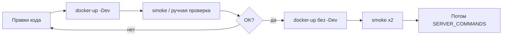

# Docker — основной контур разработки (до деплоя на сервер)

Пока проект **не на VPS**, вся разработка и проверка — **локально в Docker**.

Сервер подключим позже ([SERVER_COMMANDS.md](SERVER_COMMANDS.md)).

---

## Быстрый старт

**[PowerShell]**
```powershell
cd "F:\Проекты MyWave\NEW2026\Ruza"

# 1. Единый .env в корне (уже есть)
# 2. service-account.json в корне репо
Test-Path .env, service-account.json

# 3. DEV-режим (рекомендуется): hot reload API + Vite dashboard
.\scripts\docker-up.ps1 -Dev

# 4. Проверка
.\scripts\docker-status.ps1 -Dev
.\scripts\smoke-local.ps1
```

| URL | Назначение |
|-----|------------|
| http://127.0.0.1:8000/health | API |
| http://127.0.0.1:5173 | Dashboard |

---

## Два режима

### DEV (ежедневная работа) — `-Dev`

```powershell
.\scripts\docker-up.ps1 -Dev
```

- API: **uvicorn --reload** — правки в `apps/api/app` подхватываются сами
- Dashboard: **Vite HMR** — правки в `src/` без пересборки образа
- После изменения `.env`: `.\scripts\docker-sync-env.ps1 -Force` + `docker restart ruza-api-1` (или down/up)

### PROD-like (перед smoke gate / demo)

```powershell
.\scripts\docker-up.ps1
# или с smoke сразу:
.\scripts\docker-up.ps1 -Smoke
```

- Dashboard собран в **nginx** (как на сервере)
- После правок frontend: `.\scripts\docker-rebuild.ps1 -Target dashboard`

---

## Команды

| Команда | Действие |
|---------|----------|
| `.\scripts\docker-up.ps1 -Dev` | поднять dev-стек |
| `.\scripts\docker-down.ps1 -Dev` | остановить |
| `.\scripts\docker-status.ps1 -Dev` | статус + health + логи |
| `.\scripts\docker-logs.ps1 -Dev -Follow` | live logs |
| `.\scripts\docker-sync-env.ps1 -Force` | `.env` → `.env.docker` |
| `.\scripts\docker-rebuild.ps1 -Dev` | пересборка образов |
| `.\scripts\smoke-local.ps1` | E2E smoke на :8000 |

---

## Цикл разработки



1. Меняете код → в DEV перезапуск обычно **не нужен**
2. Меняете `.env` → `docker-sync-env.ps1 -Force` + restart api
3. Перед «готов к серверу» → prod-like + 2× green smoke
4. Сервер — только когда довольны локально

---

## Troubleshooting

**API 502 / Sheets error**
- Проверьте `service-account.json` в корне репо
- SA должен иметь доступ к spreadsheet
- `DISABLE_SYSTEM_PROXY_FOR_GOOGLE=true` уже в `.env.docker`

**Dashboard не видит API**
- `VITE_API_BASE_URL=http://127.0.0.1:8000` (браузер на хосте, не внутри контейнера)

**Порт занят**
```powershell
.\scripts\stop-local.ps1
.\scripts\docker-down.ps1 -Dev
```

**Полный сброс**
```powershell
.\scripts\docker-down.ps1 -Dev
docker system prune -f
.\scripts\docker-up.ps1 -Dev
```

---

## Файлы

- `docker-compose.yml` — prod-like (api + nginx dashboard)
- `docker-compose.dev.yml` — override для hot reload (`ports: !override` — только `5173:5173`, без дубля `5173:80` из base)
- `.env.docker` — генерируется из `.env` (не коммитить)
- `service-account.json` — mount в контейнер (не коммитить)
