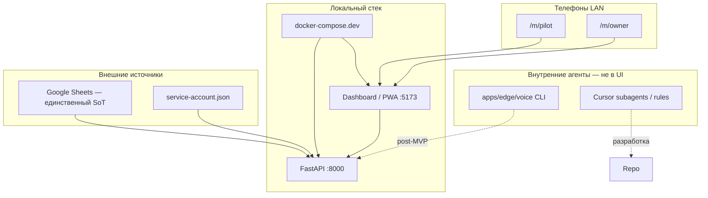

# Локальная стабилизация перед APK / продом

> Цель: закрыть **дизайн, эргономику, функционал и интеграции** на ПК + телефоне в LAN.  
> APK — только после зелёного чеклиста ниже.

Связь с North Star: `docs/MYWAVE_NORTH_STAR.md` — Cash-cow `booking → check-in → pilot → KPI`.

---

## 1. Карта системы (что с чем связано)



| Слой | Роль | Статус |
|------|------|--------|
| Google Sheets | clients, bookings, staff, KPI, audit | MVP — **нужны вкладки `checkins`, `kpi_targets`** |
| FastAPI | auth, bookings, checkins, pilot, kpi, smoke | MVP |
| Desktop UI | оператор, coach, полный dashboard | MVP |
| Mobile PWA | пилот + owner на лодке/пляже | в стабилизации |
| Edge voice | on-device FSM, без OpenAI | прототип CLI, не в mobile |
| Cursor agents | правила в `.cursor/rules/` | dev-only |

---

## 2. Чеклист стабилизации

### Фаза A — Инфра и внешние источники

- [ ] `.env` + `service-account.json` в корне (не в git)
- [ ] **Google Sheets:** вкладки `checkins`, `kpi_targets` — см. **`docs/SHEETS_TABS_SETUP.md`**
- [ ] `.\scripts\docker-up.ps1 -Dev` — API + Vite
- [ ] `.\scripts\smoke-local.ps1` — green (включая `checkins.phone`)
- [ ] `.\scripts\docker-status.ps1 -Dev` — healthy
- [ ] Sheets: staff_users, boats.pilot_user_id, тестовый клиент по телефону

**[PowerShell]**

```powershell
cd "F:\Проекты MyWave\NEW2026\Ruza"
.\scripts\docker-up.ps1 -Dev
.\scripts\smoke-local.ps1
.\scripts\mobile-lan-url.ps1
```

### Фаза B — Функционал (desktop)

- [ ] Login → role-based redirect
- [ ] Bookings: слот → бронь → список дня
- [ ] Check-in по телефону (BookingsPage)
- [ ] Pilot FSM: confirmed → arrived → ready → in_progress → done
- [ ] KPI season + plan-vs-fact
- [ ] Preflight без blockers на smoke-дату

### Фаза C — Mobile PWA (пилот + owner)

- [ ] Login с телефона → `/m/pilot` или `/m/owner` (не desktop `/pilot`)
- [ ] RBAC: вкладки только по роли
- [ ] Индикатор API в шапке mobile
- [ ] Пилот: boat_id для admin, автообновление 30с, late/no_show
- [ ] Owner: KPI + check-in + выбор даты
- [ ] `/m/install` — инструкция + LAN URL

**Ручная проверка на 2 телефонах:**

1. Пилот: login → очередь → смена статуса заезда  
2. Owner: login → KPI → check-in по телефону клиента  
3. Потеря Wi‑Fi → красный «API недоступно»

### Фаза D — Дизайн и эргономика

- [x] Login / Unauthorized на game-теме
- [x] Кнопки ≥48px на mobile
- [ ] Паритет текстов pilot desktop/mobile (общий `pilot-utils`)
- [ ] Единый build stamp / health в Layout и MobileShell
- [ ] Контраст и читаемость на солнце (полевой тест)

### Фаза E — Внутренние агенты

- [x] `apps/agents/` + internal API + `run-agent.ps1`
- [x] Voice wizard в `/m/owner`
- [x] Telegram setup doc — `docs/agents/TELEGRAM_SETUP.md`
- [ ] Telegram credentials в `.env` (owner)
- [ ] `schedule-agents.ps1` после проверки brief

---

## 3. Критерий «можно думать про APK»

| # | Критерий |
|---|----------|
| 1 | `smoke-local.ps1` green ×2 подряд |
| 2 | Телефон: pilot FSM на реальной дате со слотами |
| 3 | Телефон: owner check-in + KPI обновляется |
| 4 | Нет 403/redirect петель на `/m/*` |
| 5 | Owner и пилот довольны UX на лодке (субъективно) |

До этого **не собирать APK** — PWA через «На экран Домой» достаточно.

---

## 4. Известные ограничения

- **APK сейчас** = WebView к `http://LAN:5173`; ПК с Docker должен быть включён.
- **iPhone .ipa** без Apple Developer — только PWA.
- **Voice agent** не подключён к mobile UI.
- **Автономный offline** — не реализован (Sheets требует API).

---

## 5. Файлы

| Область | Путь |
|---------|------|
| Mobile UI | `icebeach-wakeclub/apps/dashboard/src/mobile/` |
| Маршруты | `src/router/AppRouter.tsx`, `src/utils/routes.ts` |
| API client + LAN | `src/api/client.ts` |
| Smoke | `scripts/smoke-local.ps1` |
| Docker | `docker-compose.dev.yml`, `scripts/docker-up.ps1` |
| Mobile install | `docs/MOBILE_INSTALL.md` |
| Edge voice | `icebeach-wakeclub/apps/edge/voice/` |
| North Star | `docs/MYWAVE_NORTH_STAR.md` |

---

## 6. Следующий шаг (рекомендация)

1. Запустить Docker + smoke.  
2. Пройти фазу C на двух телефонах.  
3. Зафиксировать замечания по дизайну с пляжа.  
4. Только потом — `build-android-apk.ps1` (если PWA не хватает).
