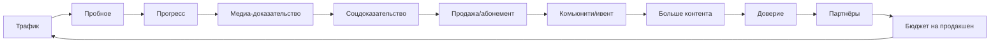

# MyWave — путеводная звезда для команды Ruza / Ice Beach

> Источник: стратегический инсайт-документ (`3.txt`).  
> Этот файл — **единый ориентир** для Orchestrator и subagents. Перед крупной задачей сверяйтесь с разделом «Связь с Ruza».

---

## 1. Единое ядро (1 фраза)

**MyWave = система роста в экшн-спорте, где прогресс измерим, подтверждён медиа-доказательствами, и монетизируется через продукты / ивенты / партнёрства.**

### Общий знаменатель всех проектов

| Принцип | Что значит для разработки |
|---------|---------------------------|
| Измеримый прогресс | KPI, booking FSM, analytics_daily, plan-vs-fact |
| Доверие | audit_log, RBAC, прозрачные статусы, preflight/smoke gates |
| Медиа-витрина | контент = актив (не «красота ради красоты»); UTM, funnel |
| Комьюнити и события | слоты, сезон, pilot queue, camp-ready schema |
| Платформа спонсорства | leads, campaigns, KPI для партнёров — **после** ядра записи |

**Рыночный контекст:** брендам нужна измеримость спонсорства; creator-бюджеты растут. SponsorOS — логическое продолжение машины доверия, не отдельная «игрушка».

---

## 2. Три двигателя денег (приоритет разработки)

```
1. Cash-cow (СЕЙЧАС)  →  запись / слоты / абонементы / клубный dashboard
2. Growth              →  товары, медиа, лагеря (позже, не блокирует MVP)
3. Option              →  SponsorOS MVP (инвентарь → бриф → KPI → отчёт)
```

**Правило для агентов:** не тратить спринт на Option, пока Cash-cow не даёт стабильный `booking → check-in → pilot → KPI` + green smoke.

---

## 3. Flywheel (куда мы ведём продукт)



**Ruza сегодня закрывает:** trial → progress → sale (бронь) → операционный контур (pilot/coach) → метрики (KPI/marketing).

---

## 4. Режим команды: ship every week

| Антипаттерн | Лекарство |
|-------------|-----------|
| Перфекционизм × параллельные фронты | Один законченный бизнес-узел в неделю |
| Архитектура без продаж | DoD = измеримый результат в Sheets + UI |
| Распыление на SponsorOS / сайт / CRM | 3-скоростная модель (см. §2) |

**Definition of Done (Orchestrator):** end-to-end `booking → pilot queue → KPI cards` + preflight без blockers + smoke green.

---

## 5. Чек-лист 10/10 → что делает Ruza

### A) Конверсионный путь «Клиент (тренировки)»

| Требование | Модуль Ruza | Статус |
|------------|-------------|--------|
| Главная → услуга → слот → контакт → подтверждение | BookingsPage, availability, clients | MVP |
| После записи: что дальше + условия | notifications (post-MVP) | backlog |
| Check-in по телефону / оператор | `/checkins`, BookingsPage | MVP |
| Очередь пилота | PilotPage, `/pilot/today` | MVP |

**Готово, если:** оператор создаёт бронь → check-in → пилот видит очередь → статус `done` в Sheets.

### B) Партнёр / спонсор (Sprint 3–4)

| Требование | Модуль Ruza | Статус |
|------------|-------------|--------|
| Лиды и воронка | `/leads`, `/marketing/funnel`, MarketingPage | v1.1 |
| KPI для marketing_read | KpiPage, analytics_daily | MVP |
| Инвентарь активов SponsorOS | вне Ruza MVP | backlog |
| Авто-отчёт PDF для спонсора | вне Ruza MVP | backlog |

### C) Метрики (управление данными, не ощущениями)

| Метрика | Где в Ruza |
|---------|------------|
| CAC / leads | `leads`, `utm_events`, `campaigns` |
| CR по CTA | UTM events + booking conversion (marketing) |
| Utilization / revenue | `kpi/summary`, `analytics_daily` |
| Plan vs fact | `kpi_targets` + KpiPage bars |

**Готово, если:** admin видит KPI day/week/month и может trigger snapshot.

### D) Доверие и юридика (минимум)

| Требование | Ruza |
|------------|------|
| consent_face / consent_voice | `clients` tab + edge voice |
| audit_log на изменения | SheetWrapper |
| Секреты не в репо | `.env`, hooks, SECURITY.md |

---

## 6. Последовательность спринтов (канон)

| Спринт | Фокус | Агенты |
|--------|-------|--------|
| **1 — деньги сейчас** | Запись безупречна + доверие (кейсы в Sheets, smoke) | Backend, Frontend, DevOps |
| **2 — LTV** | Gear/Media (вне Ruza repo) | — |
| **3 — партнёры** | Партнёрам + пакеты + KPI-контур | Marketing, Analytics |
| **4 — платформа** | SponsorOS MVP (инвентарь/бриф/отчёты) | отдельный трек |

**Текущий Ruza = Спринт 1 (+ зачатки 3):** booking stack, check-ins, KPI, leads funnel.

---

## 7. Три главных CTA экосистемы (не размывать)

На уровне **сайта MyWave** (не dashboard клуба):

1. **Записаться**
2. **Купить**
3. **Стать партнёром**

В **dashboard Ruza** эквиваленты:

1. Создать бронь / check-in
2. (товары — другой продукт)
3. Лид / marketing funnel

Любая новая фича должна усиливать **один** из этих CTA, иначе — откладываем.

---

## 8. Бренд-архитектура (контекст)

```
MyWave (masterbrand)
├── MyWave Training    ← Ice Beach / Ruza booking ops
├── MyWave Gear
├── MyWave Media
├── MyWave Events
└── MyWave SponsorOS
```

**Ruza / icebeach-wakeclub** = операционный слой **MyWave Training** для клуба «Айс пляж».

Тон UI: спокойный премиум + технологичный спорт + **цифры и статусы**, не «вдохновлялки».

---

## 9. Распределение по subagents

| Subagent | Северная звезда (фокус) |
|----------|-------------------------|
| agent-00 Orchestrator | sequencing §6, DoD §4, не распыляться |
| agent-01 Backend | Cash-cow API, audit, Sheets truth |
| agent-02 Frontend | карточки, CTA пути, role views |
| agent-03 Edge | consent-driven voice, on-device |
| agent-04 Analytics | plan-vs-fact, snapshots, решения по данным |
| agent-05 Marketing | leads, funnel, UTM — Sprint 3 |
| agent-06 DevOps | ship every week: smoke, docker, staging |

---

## 10. Перед каждым PR / задачей — 3 вопроса

1. Это усиливает **Cash-cow**, **Growth** или **Option**? Если Option — есть ли green smoke на Cash-cow?
2. Есть ли **измеримый DoD** (Sheets + endpoint + UI)?
3. Можно ли **зашипить за неделю** без новых внешних CRM/БД?

Если «нет» на (2) — уточнить scope у Orchestrator.

---

## Ссылки

- [ARCHITECTURE.md](ARCHITECTURE.md) — техстек Ruza
- [SHEETS_SCHEMA.md](SHEETS_SCHEMA.md) — контракт данных
- [KPI.md](KPI.md) — метрики
- [23_STAGING_LAUNCH_CHECKLIST.md](../icebeach-wakeclub/docs/enterprise/23_STAGING_LAUNCH_CHECKLIST.md) — gate перед demo
