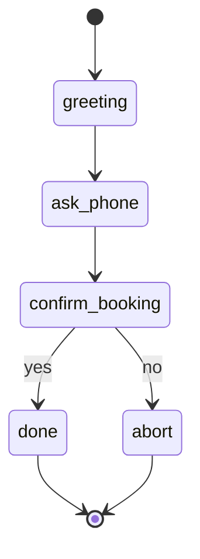

# Voice Admin Flows (FSM)

## Flow 1: Check-in by phone
1) Greeting
2) Ask phone number
3) Find today's booking(s)
4) Confirm time/boat
5) Mark arrived/ready
6) Give instructions + upsell coach if not selected

## Implementation

- FSM: `icebeach-wakeclub/apps/edge/voice/fsm.py`
- CLI: `python -m apps.edge.voice.cli` (with `SESSION_COOKIE`)
- API: `POST /checkins` with `method=phone`
- Hardware: see [HARDWARE_RECOMMENDATIONS.md](HARDWARE_RECOMMENDATIONS.md)

## Late detection (operator/pilot)
- If no check-in 10 min before slot: mark status=late, notify operator/pilot
- API: `POST /checkins/mark-late?date=YYYY-MM-DD`
