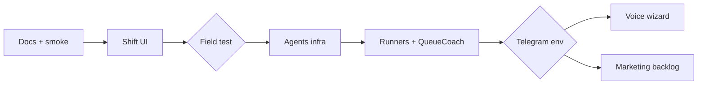

# Порядок внедрения Agents

## Фазы

| # | Фаза | Rollback point |
|---|------|----------------|
| 0 | Документация | удалить docs/agents |
| 1 | `/shift/today` + UI | откат route + page |
| 2 | `apps/agents` + internal API | отключить scripts |
| 3 | Runners по расписанию | `-Unregister` scheduler |
| 4 | Voice wizard | скрыть кнопку в UI |
| 5 | LTV, approve, `/book` | feature flags |

## Зависимости

- LateMarker требует `AGENTS_SECRET` и работающий API
- DailyBrief требует KPI + bookings endpoints
- Telegram опционален — fallback `logs/agents.log`

## Ручной контроль владельца

1. Полевой тест после фазы 1
2. Telegram credentials после фазы 2
3. Подтверждение времени brief после фазы 3
